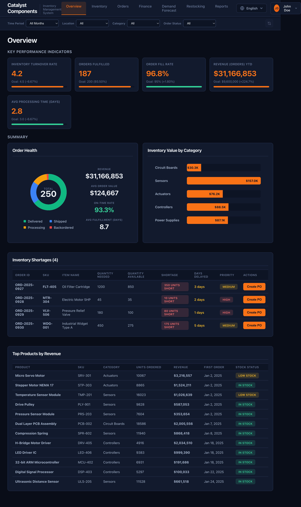
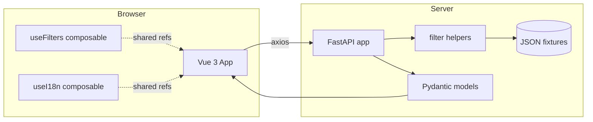

# Factory Inventory Management System

A full-stack Vue 3 + FastAPI demo that simulates factory inventory operations — stock tracking across warehouses, order management, demand forecasting, budget-based restocking, spending analytics, and performance reports. Built for a Claude Code workshop; a real working reference for agent-driven development.



## Tech Stack

| Layer    | Stack                                                                   |
|----------|-------------------------------------------------------------------------|
| Frontend | Vue 3 (Composition API) · Vite · vue-router · axios · custom i18n       |
| Backend  | Python 3.12 · FastAPI · Pydantic · uvicorn                              |
| Storage  | In-memory from JSON files in `server/data/` (no database)               |
| Tooling  | mise (toolchain) · uv (Python deps) · npm · vitest · ruff               |

## Architecture



Four global filters live in `useFilters` — **Time Period**, **Warehouse**, **Category**, **Order Status** — and every view watches them to refetch. See `client/src/composables/useFilters.js`.

## Getting started

The project expects [mise](https://mise.jdx.dev/) to manage Python and Node versions. `mise.toml` pins them.

```bash
# Backend (http://localhost:8001)
cd server
mise exec -- uv sync
mise exec -- uv run python main.py

# Frontend (http://localhost:3000)
cd client
mise exec -- npm install
mise exec -- npm run dev
```

Or use the convenience scripts (macOS/Linux):

```bash
./scripts/start.sh     # Starts both
./scripts/stop.sh      # Kills both
```

API docs at <http://localhost:8001/docs> (FastAPI's generated Swagger UI).

## Project structure

```
inventory/
├── client/                      # Vue 3 frontend
│   ├── src/
│   │   ├── App.vue              # Shell: sidebar, layout, design tokens (:root)
│   │   ├── main.js              # Router, app mount
│   │   ├── api.js               # All backend calls, one place
│   │   ├── views/               # Page components (routed)
│   │   ├── components/          # Reusable UI (modals, filter bar, etc.)
│   │   ├── composables/         # useFilters, useI18n, useAuth
│   │   ├── locales/             # en.js, ja.js translations
│   │   └── utils/               # currency formatting, etc.
│   └── vitest.config.js         # Frontend test config
├── server/                      # Python FastAPI backend
│   ├── main.py                  # All routes + Pydantic models
│   ├── mock_data.py             # JSON loader (module-level state)
│   ├── data/                    # Fixture data (7 JSON files)
│   └── pyproject.toml           # uv deps + ruff config
├── tests/
│   ├── backend/                 # pytest + FastAPI TestClient
│   └── frontend/                # vitest + @vue/test-utils
├── scripts/                     # start.sh, stop.sh, test.sh
├── docs/
└── mise.toml                    # Toolchain pins
```

## API reference

All `GET` endpoints accept the filter params noted. Filters use `'all'` as a skip sentinel.

### Inventory · Orders · Dashboard

| Endpoint                          | Filters                                          | Description                                    |
|-----------------------------------|--------------------------------------------------|------------------------------------------------|
| `GET /api/inventory`              | `warehouse`, `category`                          | SKU catalog with lead times and reorder points |
| `GET /api/inventory/{id}`         | —                                                | Single item                                    |
| `GET /api/orders`                 | `warehouse`, `category`, `status`, `month`       | Customer orders                                |
| `GET /api/orders/{id}`            | —                                                | Single order                                   |
| `GET /api/dashboard/summary`      | all four                                         | KPIs, totals, counts                           |

### Demand · Backlog · Reports

| Endpoint                          | Filters | Description                               |
|-----------------------------------|---------|-------------------------------------------|
| `GET /api/demand`                 | —       | Demand forecasts                          |
| `GET /api/backlog`                | —       | Unfulfilled order items                   |
| `GET /api/reports/quarterly`      | —       | Per-quarter totals + fulfillment rate     |
| `GET /api/reports/monthly-trends` | —       | Per-month revenue and order counts        |

### Spending

| Endpoint                             | Description                       |
|--------------------------------------|-----------------------------------|
| `GET /api/spending/summary`          | Totals + deltas                   |
| `GET /api/spending/monthly`          | Monthly cost categories           |
| `GET /api/spending/categories`       | Spend by category                 |
| `GET /api/spending/transactions`     | Recent transactions               |

### Restocking (new)

| Endpoint                             | Body / filters                         | Description                               |
|--------------------------------------|----------------------------------------|-------------------------------------------|
| `GET /api/restocking/candidates`     | `warehouse`, `category`                | Shortfall items = forecast − on-hand      |
| `POST /api/restocking/orders`        | `CreateRestockingOrderRequest`         | Submits; generates `RO-YYYY-NNNN` id      |
| `GET /api/restocking/orders`         | —                                      | All submitted restocking orders           |

## Design system

CSS design tokens live in `client/src/App.vue` `:root`. Views consume them through scoped styles:

- **Color:** `--color-bg`, `--color-surface`, `--color-border`, `--color-text`, `--color-text-muted`, `--color-accent`, plus semantic `--color-success`, `--color-warning`, `--color-danger`, `--color-info` (each paired with a `-bg` variant).
- **Layers:** `--radius-sm|md|lg`, `--shadow-sm|md|lg`.
- **Spacing:** `--space-1` through `--space-8` on a 0.25rem grid.
- **Shell:** `--sidebar-width` / `--sidebar-width-collapsed` drive the collapsible left nav.

Global class helpers in `App.vue` — `.card`, `.stat-card`, `.stats-grid`, `.page-header`, `.badge.{success|warning|danger|info|high|medium|low|increasing|stable|decreasing}` — are shared across every view; don't redefine them in scoped styles.

## Development workflow

### Frontend

```bash
cd client
mise exec -- npm run dev         # Dev server with HMR
mise exec -- npm run build       # Production build to client/dist
mise exec -- npm test            # Vitest unit tests
mise exec -- npm run test:watch  # Watch mode
mise exec -- npm run lint        # ESLint
mise exec -- npm run format      # Prettier write
```

### Backend

```bash
cd server
mise exec -- uv run python main.py          # Dev server
mise exec -- uv run pytest ../tests/backend # Full test suite
mise exec -- uv run ruff check .            # Lint
mise exec -- uv run ruff format .           # Format
```

### i18n

Every user-visible string goes through `t()` from `useI18n`. Add keys to **both** `client/src/locales/en.js` and `client/src/locales/ja.js` in matching positions. The composable falls back to English if a Japanese key is missing, but missing keys are a bug — don't rely on it.

### Adding a feature

1. **Backend:** define Pydantic model → add route in `main.py` → add to `tests/backend/`.
2. **API client:** add method to `client/src/api.js`.
3. **View:** create/edit `.vue` file using Composition API, `useFilters`, `useI18n`, `api` client. Reuse global classes and tokens; don't invent parallel styles.
4. **Nav:** add route to `main.js`, add sidebar entry to `App.vue`, add `nav.<name>` keys to both locales.
5. **Test:** unit tests for pure logic, component tests for interaction.

See `CLAUDE.md`, `client/CLAUDE.md`, and `server/CLAUDE.md` for the longer engineering conventions.

## Data model (fixtures)

All data lives in `server/data/` and loads into memory at startup. Mutations (e.g., submitted restocking orders) persist only for the process lifetime.

| File                     | Shape                                                                         |
|--------------------------|-------------------------------------------------------------------------------|
| `inventory.json`         | SKU, name, category, warehouse, quantity_on_hand, reorder_point, unit_cost, lead_time_days |
| `orders.json`            | Customer orders with items, status, dates, total_value                        |
| `demand_forecasts.json`  | SKU, current_demand, forecasted_demand, trend, period                         |
| `backlog_items.json`     | order_id, sku, needed vs. available, days_delayed, priority                   |
| `purchase_orders.json`   | Backlog-driven purchase orders (empty by default)                             |
| `spending.json`          | Aggregate summary, monthly breakdown, category breakdown                      |
| `transactions.json`      | Individual transactions (date, vendor, category, amount)                      |

## Platform notes

- **macOS/Linux:** `scripts/start.sh` and `scripts/stop.sh` work out of the box.
- **Windows:** run the manual commands above in two terminals. Ctrl+C to stop.

---

Demo application. No auth, no rate limiting, in-memory only — not production-ready without a database, authentication, and security hardening.
